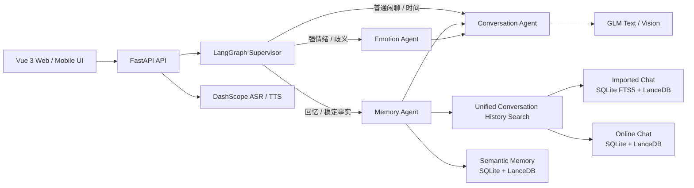
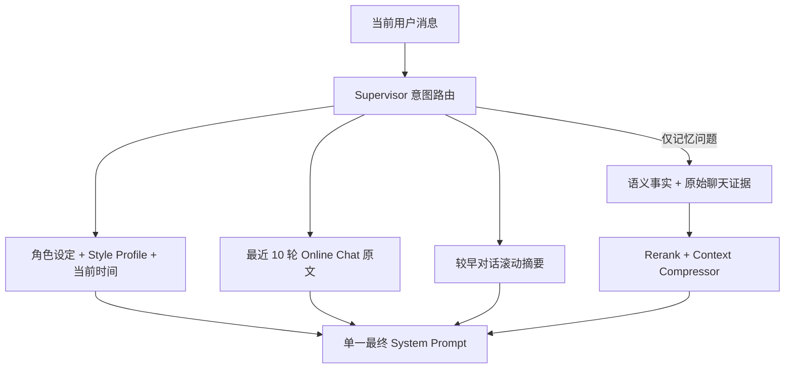
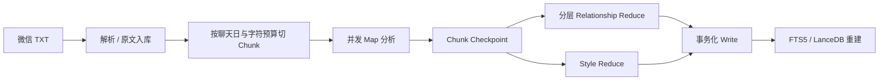

# 赵晶莹 · Memory-Driven AI Companion

[](https://www.python.org/)
[](https://fastapi.tiangolo.com/)
[](https://www.djangoproject.com/)
[](https://vuejs.org/)
[](https://www.langchain.com/langgraph)
[](LICENSE)

一个以“长期记忆与人格延续”为核心的多模态 AI Companion。项目可导入真实微信聊天记录，将数万条原始对话处理成可检索证据、长期事实、关系演变和说话风格，并在后续文字、图片和语音聊天中按需召回，而不是把所有历史粗暴塞入系统提示词。

> 核心目标：让 AI 不只是“知道一些资料”，而是能在有限上下文窗口内，基于正确证据、当前关系状态和角色表达习惯自然地继续一段长期对话。

## 为什么这个项目值得关注

普通角色聊天项目通常只做“角色 Prompt + 最近几轮消息”。本项目重点解决更接近真实长期陪伴的工程问题：

- **记忆如何可信**：原始聊天永久保留，长期事实携带主体、来源、状态、置信度和证据引用。
- **上下文如何可控**：普通闲聊不检索，回忆问题才进入记忆链路；较早对话滚动压缩，最近原文保持完整。
- **历史如何统一搜索**：导入微信聊天和后续 AI 对话底层分开保存，通过同一检索接口合并召回。
- **大规模预处理如何恢复**：长聊天分块并行分析，Chunk 结果持久化；余额耗尽或进程中断后可断点续跑。
- **人格如何稳定**：Style Profile 仅依据导入的真实角色消息学习，控制称呼、语气、长度和多气泡节奏。
- **多模态如何不污染记忆**：图片原文件单独保存，只在最终视觉模型阶段传入；检索、情绪和日志链路只接收干净文本。

项目已在一份 **23,261 条真实聊天消息**的数据集上完成全量预处理验证，覆盖 304 个 Analysis Chunk 的断点恢复、关系 Reduce、Style Reduce、长期事实写入和向量索引一致性校验。

## 系统架构



后端采用 FastAPI 作为 API 与流式响应入口，Django 提供 ORM、迁移和 Admin；同步 ORM、Pillow 等工作由 FastAPI 工作线程承载，LLM、WebSocket 与流式聊天保持异步边界。

## 核心亮点

### 1. 证据可追溯的分层记忆

项目明确区分“原始发生过什么”和“模型从中总结出了什么”：

| 层级 | 权威存储 | 作用 |
| --- | --- | --- |
| Imported Chat | `ChatMessage` / SQLite | 微信导入原文，支持 FTS5、向量检索和上下文窗口扩展 |
| Online Chat | `Message` / SQLite | 后续用户与 AI 的完整原始聊天，Reflection 后也不会删除 |
| Semantic Memory | `SemanticMemory` / SQLite | 身份、偏好、经历、关系模式等结构化长期事实 |
| Vector Projection | LanceDB | Imported Chat、Online Chat 和 Semantic Memory 的语义检索副本 |
| Working Summary | `Friend.conversation_summary` | 较早 Online Chat 的滚动工作摘要，不替代原文 |
| Reflection Job | `ReflectionJob` / SQLite | 按聊天日从 Online Chat 提炼长期事实的持久任务 |

Semantic Memory 不只是文本，还包含：

- `subject`：`user`、`girlfriend`、`relationship`
- `category`：身份、偏好、经历、关系规律
- `source`：微信导入、AI Reflection、用户手动维护
- `memory_state`：`current`、`historical`、`superseded`
- `valid_from / valid_to`：表达事实的时间有效区间
- `is_mutable / is_locked`：控制自动更新能否改写核心事实
- `MemoryEvidence`：关联原始消息索引或 Online Message ID

SQLite 是结构化事实的真源，LanceDB 只负责检索投影。重建索引时使用临时表校验、表名切换和旧表清理，避免 append 导致重复向量、过期向量长期堆积。

### 2. 统一原始对话检索

导入聊天和后续 AI 聊天的生命周期不同，因此没有强行塞进同一张表；`ConversationHistorySearch` 在它们之上提供统一接口：

```text
用户问题
  -> Query Rewrite（最多 3 个检索表达）
  -> ImportedChatAdapter
       -> SQLite FTS5 / LanceDB
       -> 命中消息前后扩展原文窗口
  -> OnlineChatAdapter
       -> SQLite 关键词 / 模糊匹配
       -> LanceDB 语义检索
  -> 跨来源去重与分数归一化
  -> Reranker
  -> Context Compressor
  -> 有界 memory_context
```

例如用户问“我以前是不是说过不喜欢香菜”，系统可以同时找到微信原话和之后 AI 聊天中的新表述，并保留来源与消息引用，而不是只返回一条脱离语境的摘要。

### 3. 上下文工程，而不是无限堆 Prompt

每次模型请求使用一份按需组装的上下文投影：



关键策略：

- Online Chat 超过 15 轮后触发压缩，保留最近 10 轮原文；压缩失败时安全降级，不丢失尚未摘要的消息。
- 普通闲聊和时间问题跳过 Memory Agent，减少延迟、Token 和无关记忆污染。
- Relationship Overview 只在关系/回忆需要时进入记忆上下文，不再每轮全量注入。
- `Friend.memory` 保留为兼容缓存和管理视图，但不再整段塞入系统提示词。
- 检索结果先跨来源去重，再重排和压缩，控制最终证据数量与字符预算。
- 图片 Base64 不进入 Supervisor、Memory Agent、Emotion Agent 或普通 Trace，只进入最终视觉模型调用。

### 4. 混合意图路由与 Multi-Agent 编排

Supervisor 使用“确定性规则优先、LLM 处理歧义”的混合路由：

| Agent | 职责 |
| --- | --- |
| Supervisor | 区分闲聊、时间、稳定记忆、具体回忆和情绪需求 |
| Memory Agent | 时间范围定位、Semantic Memory、统一原文检索、话题补充、重排压缩 |
| Emotion Agent | 识别情绪类型、强度和建议语气，只输出结构化状态 |
| Conversation Agent | 汇总唯一 System Prompt，生成符合角色风格的结构化气泡数组 |

明确问题通过关键词和时间信号零额外延迟路由；“算了”“没事”“你忙吧”或含 emoji 的歧义表达再交给 GLM 分类。这样兼顾可解释性、成本和召回准确率。

### 5. 可恢复的聊天预处理 Pipeline



- 超长聊天日按字符预算继续拆分，并保留少量 overlap，避免只分析每天最后几十条。
- 每个 Chunk 使用源数据 fingerprint 和 chunk fingerprint 持久化结果。
- API 余额耗尽、网络异常或进程退出后，只重跑失败/缺失 Chunk。
- 任一 Map Chunk 失败时状态变为 `partial`，不会把残缺结果写成正式 Relationship、Style 或 Semantic Memory。
- 写入阶段清理旧导入派生数据并使用数据库事务，重新导入不会混入上一次结果。
- Style Profile 每次成功重新导入后基于完整 Imported Chat 重新生成，不受 Online Chat 漂移影响。

### 6. Style Profile 与即时通讯式回复

Style Reduce 从角色本人消息中统计和抽样，生成有界风格指南：

- 常用称呼、语气和措辞
- emoji / 情绪表达习惯
- 回复长度分布
- 一次回复通常拆成几个消息气泡
- 互动方式和应避免的表达

Conversation Agent 输出 `{"bubbles": [...]}`，前端按数组逐条渲染。普通短句即使被模型错误地放在同一元素中，也会经过安全兜底拆分；Markdown、列表、代码块和长解释仍保持完整。多个气泡按文字长度加入自然发送间隔，并显示“正在输入”状态。

### 7. 多模态与语音

- 支持 JPG、PNG、WebP 图片上传，校验格式、大小和像素后去除元数据并统一转换为 WebP。
- 图片通过 `MessageAttachment` 与原始 `Message` 关联，历史记录可完整回显。
- GLM Vision 用于识别照片、截图文字和表情包语气。
- DashScope `gummy-realtime-v1` 提供 ASR，`cosyvoice-v3-flash` 提供流式 TTS。
- 前端通过 MediaSource 播放 MP3 流，并在用户发送/点击麦克风时处理浏览器自动播放授权。
- 情绪标记在展示层转换为 emoji；用户输入的 emoji 会以结构化含义交给 Supervisor，而不会改写原始消息。

### 8. 隐私、可靠性与可观测性

- 导入记忆支持 `private / public` 可见性，默认隔离不同用户的私有聊天和派生记忆。
- 手动记忆可以锁定，Reflection 不得随意覆盖角色身份和历史事实。
- Reflection 采用持久日级任务、唯一约束、原子抢占、失败重试和超时任务恢复。
- 在线聊天原文永久保留；摘要、Semantic Memory 和 LanceDB 都是可重建的派生层。
- 提供聊天文本脱敏工具，可识别密码、身份证号及自定义敏感前缀，且不修改原文件。
- 可选 LangSmith Trace 覆盖路由、检索、压缩、最终 Prompt、预处理和 Reflection。

## 前端体验

- Vue 3 + Tailwind CSS + DaisyUI 的响应式界面，兼容桌面与移动端。
- 电影感视频背景、玻璃拟态导航和角色资料页。
- 图片预览、文字/语音输入、多气泡延迟、时间分隔和在线/输入状态。
- Memory Manager 支持查看、新增、编辑、删除和锁定长期记忆。
- 微信导入展示 Chunk 级进度、失败数量、阶段状态和断点续跑入口。
- Style Profile 在角色编辑页只读展示，便于验证模型学到的表达规则。

## 数据与存储设计

| 组件 | 保存内容 | 定位 |
| --- | --- | --- |
| SQLite | 用户、角色、Friend、原始消息、长期事实、证据、任务和分析结果 | 当前主数据库与结构化真源 |
| SQLite FTS5 | Imported Chat 全文索引 | 精确词与中文原文召回 |
| LanceDB | Semantic Memory、Imported Chat、Online Chat 向量投影 | 本地语义搜索，可安全重建 |
| 本地 Media | 头像、背景、聊天图片、音色样本 | 文件存储；数据库只保存路径与元数据 |
| LangSmith（可选） | Agent / RAG / LLM Trace | 调试和可观测性 |

当前单机版选择 SQLite + LanceDB，部署简单、适合个人数据本地化。后续多用户和多实例部署可迁移到 PostgreSQL + pgvector；统一检索 Adapter 已将上层 Agent 与底层存储解耦。

## 技术栈

| 层级 | 技术 |
| --- | --- |
| Web API / Streaming | FastAPI, Uvicorn, SSE, WebSocket |
| ORM / Migration / Admin | Django 6, Django Admin |
| AI Orchestration | LangGraph, LangChain |
| Text / Vision LLM | 智谱 GLM OpenAI-compatible API |
| Embedding / ASR / TTS | 阿里云 DashScope |
| Database / Search | SQLite, FTS5, LanceDB |
| Frontend | Vue 3, Vite, Pinia, Vue Router, Tailwind CSS, DaisyUI |
| Image Processing | Pillow |
| Observability | LangSmith（可选） |
| Testing / Tooling | pytest, pytest-django, uv, npm |

## 项目结构

```text
zhaojingying-cc/
├── main.py                    FastAPI 入口、CORS、Admin、媒体与 SPA
├── api/                       鉴权、角色、聊天、图片、记忆、导入、语音 API
├── ai/
│   ├── agents/                Supervisor / Memory / Emotion / Conversation
│   ├── chat/                  结构化气泡解析与兜底
│   ├── memory/                语义记忆、统一历史检索、摘要、Reflection
│   ├── preprocessing/         Chunk / Map / Reduce / Style / Writer Pipeline
│   ├── rag/                   Query Rewrite / Retriever / Reranker / Compressor
│   └── tools/                 当前时间等内部上下文工具
├── web/                       Django Models、Admin、Migrations、管理命令
├── frontend/                  Vue 3 响应式前端
├── tools/                     微信解析和隐私脱敏工具
├── tests/                     Agent、Memory、RAG、预处理、图片上传测试
├── docs/                      架构路线图和产品设计文档
├── django_settings.py         Django / SQLite / JWT / Media 配置
├── pyproject.toml             Python 依赖与测试配置
└── .env.example               环境变量模板
```

## 快速开始

### 环境要求

- Python 3.12+
- Node.js `^20.19.0` 或 `>=22.12.0`
- [uv](https://docs.astral.sh/uv/)
- npm

### 1. 克隆与配置

```bash
git clone https://github.com/liujunjie20240416/zhaojingying-cc.git
cd zhaojingying-cc
cp .env.example .env
```

至少配置：

```dotenv
DJANGO_SECRET_KEY="replace-me"
GLM_API_KEY=""
GLM_API_BASE="https://open.bigmodel.cn/api/paas/v4"
GLM_MODEL="glm-5.2"

VISION_LLM_MODEL="glm-5v-turbo"

DASHSCOPE_API_KEY=""
DASHSCOPE_API_BASE="https://dashscope.aliyuncs.com/compatible-mode/v1"
DASHSCOPE_WSS_URL="wss://dashscope.aliyuncs.com/api-ws/v1/inference"
```

视觉密钥和 Base URL 未单独填写时会复用 `GLM_*`；生成式文本任务统一走 GLM，DashScope 密钥仅用于 Embedding、ASR、TTS 和音色服务。

### 2. 启动后端

```bash
uv sync
uv run python manage.py migrate
uv run uvicorn main:app --reload --port 8000
```

- API：`http://127.0.0.1:8000`
- Django Admin：`http://127.0.0.1:8000/admin`

### 3. 启动前端

```bash
cd frontend
npm install
npm run dev
```

前端开发地址：`http://127.0.0.1:5173`

### 4. 生产构建

```bash
cd frontend
npm run build
```

构建产物输出到 `static/frontend/`，FastAPI 会托管 SPA 页面。

## 常用运维命令

```bash
# 数据库迁移
uv run python manage.py migrate

# 完整测试
uv run pytest

# 从断点恢复聊天预处理
uv run python manage.py resume_import_preprocessing --character-id 1

# 重建 Style Profile
uv run python manage.py rebuild_style_profile --character-id 1

# 重建 Online Chat 向量索引
uv run python manage.py rebuild_online_history_index --friend-id 1

# 处理持久 Reflection 任务
uv run python manage.py run_reflection_jobs
```

## 简历描述参考

可以根据实际岗位压缩成以下表述：

> **Memory-Driven AI Companion｜个人全栈 AI 项目**
> 基于 FastAPI、Django、Vue 3、LangGraph 和 GLM 构建多模态 AI Companion；设计 Imported Chat、Online Chat、Semantic Memory、滚动摘要四层记忆体系，通过 FTS5 + LanceDB 混合检索、Query Rewrite、Rerank 与 Context Compressor 实现跨来源证据召回。实现 2.3 万条真实聊天数据的并发 Map/Reduce 预处理、Chunk Checkpoint 断点续跑、关系时间线与角色 Style Profile 学习；使用持久日级 Reflection 任务、原子写入和可重建向量投影保证长任务可靠性，并支持图片理解、ASR/TTS、结构化多气泡回复和移动端适配。

可拆分的技术亮点：

- 设计统一 Conversation History Search，在不合并底层表的前提下统一检索微信原文和后续 AI 原始对话。
- 设计“滚动摘要 + 最近 10 轮原文 + 按意图检索证据”的上下文预算，减少系统 Prompt 重复和无关记忆注入。
- 将 2.3 万条聊天切分为 304 个可恢复 Analysis Chunk，支持并发处理、失败重试、partial 状态和断点续跑。
- 设计带时间状态、可变性、锁定与证据引用的 Semantic Memory，解决重复事实和新旧事实冲突。
- 构建 GLM 文本/视觉与 DashScope 语音链路，支持图片理解、流式 TTS 和即时通讯式多气泡交互。

## 测试与质量

```bash
uv run pytest
cd frontend && npm run build
```

默认测试不访问外部模型；如需运行真实 GLM 集成用例：

```bash
RUN_LLM_INTEGRATION_TESTS=1 uv run pytest -m llm_integration
```

测试覆盖 Agent 路由、记忆隔离、统一历史检索、上下文摘要、Reflection 并发、预处理 Chunk、LanceDB 索引、结构化气泡、图片上传与隐私控制。

提交代码前请确认以下本地数据没有进入 Git：

- `.env` 与 API Key
- `db.sqlite3`
- `media/`
- LanceDB 本地索引
- 微信聊天原文件和脱敏输出文件
- `.venv/`、`node_modules/`、前端构建产物

## 后续方向

- PostgreSQL + pgvector 多用户部署
- 私密关系时间线、纪念日与用户可控的主动陪伴
- MCP / Skills 接入外部日程、知识库和工具
- 独立任务队列与多实例 Reflection / Preprocessing Worker
- 更完整的关系冲突检测、事实合并评估和记忆可解释界面

详细路线图见 [docs/2026-07-11-product-architecture-roadmap.md](docs/2026-07-11-product-architecture-roadmap.md) 与 [docs/2026-07-13-companion-experience-plan.md](docs/2026-07-13-companion-experience-plan.md)。

## License

MIT License，见 [LICENSE](LICENSE)。

## 作者

**Junjie Liu** · [GitHub @liujunjie20240416](https://github.com/liujunjie20240416)

## 项目初心

人与人之间留下的不只是几条“事实”，还有称呼、语气、共同经历、没说完的话和关系随时间发生的变化。这个项目尝试用可追溯的记忆与克制的上下文工程，保存这些细节，并让 AI 的回应更接近真正的“记得”。
