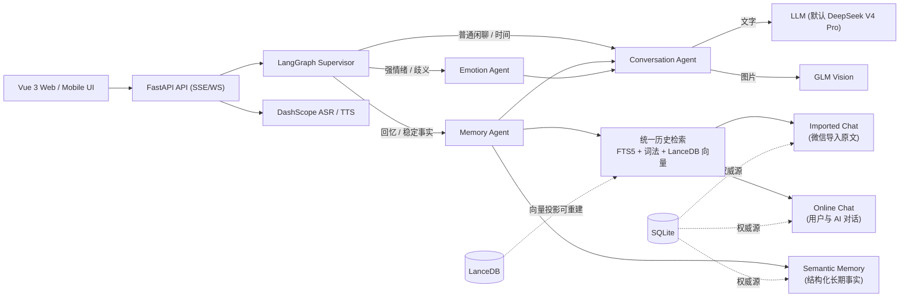

# DeepEcho（千寻）项目全解与面试指南

> 一份文档完成两件事：**① 让你彻底看懂这个项目怎么运转**；**② 让你能把项目讲给面试官听，并且经得起追问。**
>
> 阅读建议：第一遍只看 Part A + Part B（20 分钟）；面试前刷 Part C + Part D；被问到薄弱点时查 Part E。

---

## 目录

- [Part A 项目速览（30 秒到 5 分钟怎么讲）](#part-a-项目速览)
- [Part B 项目如何运转（架构与两条完整链路）](#part-b-项目如何运转)
- [Part C 核心设计要点详解（面试讲题素材）](#part-c-核心设计要点详解)
- [Part D 面试官 Q&A（20+ 题标准答法）](#part-d-面试官-qa)
- [Part E 容易被攻击的弱点与防御话术](#part-e-容易被攻击的弱点与防御话术)
- [Part F 简历与口头表述模板](#part-f-简历与口头表述模板)

---

# Part A 项目速览

## 一句话定位

**一个"长期记忆与人格延续"驱动的多模态 AI 陪伴应用：导入真实微信聊天记录，把几万条原始对话加工成可追溯的长期记忆，让 AI 在后续聊天中像"真的记得"一样自然回应，而不是每次把所有历史粗暴塞进提示词。**

## 30 秒电梯演讲（背下来）

> 我做了个 AI 陪伴项目叫千寻（DeepEcho）。市面上大多数聊天项目就是"角色 Prompt + 最近几轮消息"，聊多了就失忆。我的项目核心是解决**长期记忆**问题：支持导入上万条真实微信聊天记录，用一套可断点恢复的预处理流水线，把原文提炼成结构化长期记忆（身份、偏好、经历、关系演变），存进 SQLite 作为权威源，同时建 FTS5 全文索引和向量索引。聊天时，一个多 Agent 系统先判断用户意图——是闲聊、回忆、还是有情绪——只有回忆类问题才进记忆检索链路，检索结果经过重排压缩后按 token 预算拼进上下文。所有记忆都带原文证据，可追溯、可重建、可降级，LLM 挂了也不会让整轮对话失败。

## 1 分钟版（加"为什么值得做"）

> 我做了个 AI 陪伴项目叫千寻（DeepEcho）。它解决的核心问题是：**AI 陪伴的长期记忆**。
>
> 普通聊天项目聊完就忘，但真实的亲密关系有大量"记住"的需求：她会记得我不吃香菜、记得我们的纪念日、记得我们吵过架又和好。我的项目就是把这个"记住"做成工程。
>
> 架构上分三层：**数据层**是 SQLite（原文权威存储）+ FTS5（中文全文索引）+ LanceDB（向量索引）；**加工层**是把微信聊天记录切块、并行用 LLM 分析、断点续跑、归约出长期记忆的预处理流水线；**推理层**是一个 LangGraph 多 Agent 系统——Supervisor 用规则+LLM 混合路由意图，Memory Agent 负责检索，Emotion Agent 识别情绪，Conversation Agent 最终按角色风格生成多条气泡回复，通过 SSE 流式返回，还带 TTS 语音。
>
> 我用 2.3 万条真实聊天消息做过全量验证，期间还解决了 LLM 输出不可靠、并发折叠竞态、向量索引一致性、上下文 token 预算等一系列工程问题。这是我从零设计的一个完整全栈 AI 项目。

## 5 分钟版（按 Part C 的八个要点展开讲）

1. **四层记忆体系**（为什么分层、谁是权威、派生层怎么重建）
2. **统一历史检索**（中文 FTS5 分词方案、向量混合检索、去重重排压缩）
3. **上下文工程**（软硬预算、CJK 估算、滚动折叠、意图驱动检索）
4. **混合意图路由 + 多 Agent 编排**（规则优先、LLM 兜底、意图继承省调用）
5. **可恢复预处理 Pipeline**（聊天日、Chunk、双指纹断点、partial 语义）
6. **Style Profile**（从角色本人消息学习说话风格）
7. **多模态与语音**（图片走 GLM、ASR/TTS、前端气泡渲染）
8. **并发安全、隐私与降级**（代际号、行锁、CAS 抢占、私有数据隔离）

每一点的完整讲法见 Part C。

---

# Part B 项目如何运转

## 系统架构图



**一句话记架构**：FastAPI 提供 API 和流式接口，Django 只做 ORM/Admin，LangGraph 编排四个 Agent，SQLite 是唯一权威源，FTS5 和 LanceDB 都是可重建的检索投影。

## 一次对话的完整链路（面试必讲）

```
用户在聊天框发消息（文字或图片）
  │
  ▼
POST /api/friend/message/chat/（JWT Bearer 鉴权 → 校验 friend 归属 → 附件校验）
  │
  ▼
组装上下文：角色设定 + Style Profile + 最近原文 + 滚动摘要 + 上一轮意图
  │
  ▼
LangGraph 执行（在 TTS WebSocket 会话内异步运行）：
  1. Supervisor 路由：关键词规则 → 必要时 LLM 分类（20s 超时）
     - 闲聊/时间 → Conversation Agent（普通闲聊不查记忆，省 token）
     - 回忆/记忆 → Memory Agent（语义事实 + 原文证据检索 + 重排压缩）
     - 强情绪 → Emotion Agent（输出情绪强度与建议语气，再回 Conversation）
  2. Conversation Agent：按 token 预算拼装最终 System Prompt
     - 有图片 → 走 GLM 视觉模型；否则走文本 LLM（DeepSeek）
     - 输出 {"bubbles": [...]} 结构化多气泡 JSON
  3. 气泡解析与兜底拆分（模型乱用换行 → 按规则拆成多个气泡）
  │
  ▼
SSE 流式返回：bubbles 整组 → audio 逐帧（TTS）→ reply_provenance → [DONE]
  │
  ▼
落库（事务 + 行锁 + 代际校验，失败/空回复不落库）
  → 增量建向量索引 → 入队当日 Reflection 任务（后台线程）
```

## 一次微信导入的完整链路（预处理流水线）

```
上传 TXT（UTF-8，可带/不带方括号时间戳，自动噪音过滤）
  │
  ▼
解析入库：ChatMessage 全量重建（msg_index 0..N 顺序编号）
  → 建 FTS5（DROP 重建 + jieba tokens 列）→ 建 LanceDB 表
  │
  ▼
后台线程启动预处理（每个角色最多一个并发 worker）：
  Chunk 切分（0 次 LLM）：按"聊天日"分界（凌晨最安静小时+1）
    → 日内超限再切（≤120 条 / ≤10000 字符 / 重叠 6 条）
  Map（5 并发 LLM）：每个 Chunk 分析摘要/话题/关键事件/双方事实（带证据编号）
    → 结果持久化到 PreprocessingCheckpoint（双指纹）
  Reduce：Relationship Reduce（分层归约：日→月→年→全局）+ Style Reduce
  Write（事务）：删旧投影 → 写 TimeChunk/TopicTag/SemanticMemory/Relationship Overview
    → 重建向量索引 → 覆盖写入 style_profile
  │
  ▼
进度反馈（轮询）：map 阶段封顶 95%，失败 → partial 状态，可"从断点继续"
```

## 项目怎么启动运行

```bash
# 后端
uv sync
cp .env.example .env          # 配 LLM_API_KEY、VISION_LLM_API_KEY、DASHSCOPE_API_KEY
uv run python manage.py migrate
uv run uvicorn main:app --reload --port 8000    # API + Admin(/admin) + SPA

# 前端
cd frontend && npm install && npm run dev       # http://127.0.0.1:5173
npm run build                                     # 产物进 static/frontend/，FastAPI 托管

# 常用运维
uv run pytest                                    # 测试
uv run python manage.py resume_import_preprocessing --character-id 1   # 断点续跑
uv run python manage.py rebuild_style_profile --character-id 1          # 重建风格
uv run python manage.py run_reflection_jobs --watch                    # 常驻反思 worker
```

---

# Part C 核心设计要点详解

> 每个要点按同一结构讲：**是什么 → 为什么 → 怎么实现 → 面试官可能追问什么**。

## C1. 四层记忆体系：权威源与投影分离

**是什么**：记忆分四层——微信导入原文（Imported Chat）、用户与 AI 的在线聊天（Online Chat）、结构化长期事实（Semantic Memory）、滚动摘要与阶段胶囊（Conversation Collapse / Working Summary）。

**为什么**：把"原始发生了什么"和"模型总结出了什么"分开。总结可以错、可以过期、可以重建，但原文永远在。这样记忆出错了可以溯源修正，而不是信任一坨不可解释的摘要。

**怎么实现**：

| 层 | 权威存储 | 作用 |
| --- | --- | --- |
| Imported Chat | `ChatMessage` / SQLite | 微信原文，FTS5 + 向量检索 + 上下文窗口扩展 |
| Online Chat | `Message` / SQLite | 用户与 AI 完整对话，Reflection 后不删除原文 |
| Semantic Memory | `SemanticMemory` / SQLite | 结构化长期事实：subject（用户/女友/关系）、category、置信度、时间有效区间、可变性、证据引用 |
| 派生层 | 摘要/胶囊/向量索引 | 全部可重建；折叠只生成投影视图，绝不删原文 |

**可靠性细节**：
- 记忆事实带 `memory_state`（current/historical）、`valid_from/valid_to`、`trajectory_key`（演变时间线：喜欢辣 → 不能吃 → 又能吃辣 是同一条轨迹而非三行孤立记录）、`is_locked/is_mutable`（核心事实不可被自动改写）。
- `MemoryEvidence` 关联原文：导入证据存 `msg_index`，在线证据存 `Message.id`，用户手动存 `user_assertion`。每条记忆可展开查看原始上下文（±3 条消息窗口 + 可见性校验）。
- 重建流程：SQLite 是权威；向量索引用"临时表 + 行数校验 + overwrite 替换"重建，失败保留旧索引（投影坏了不影响数据）。

**追问应对**：
- "为什么不用一张表装所有东西？" → 两类聊天生命周期不同（导入是批量的、在线是实时的），但上层用统一的 ConversationHistorySearch 接口屏蔽差异，避免强行合并表带来的耦合。
- "为什么不用 JSON 直接存向量？" → SQLite 不支持高效的相似度检索；LanceDB 本地化、无服务、可重建，对单机个人项目比 pgvector 简单。

## C2. 中文全文检索：FTS5 的分词方案

**是什么**：导入聊天用 SQLite FTS5 做关键词检索。**中文检索的第一个坑：FTS5 的 unicode61 tokenizer 不切中文——整段中文会被当成一个 token，`MATCH "生日"` 永远查不到**。

**怎么实现**：建表时多存一列 `tokens`，导入时经 `_sync_fts5_table` **先 DROP 旧表再全量重建**（存量表可能是无 tokens 列的结构，IF NOT EXISTS 不会升级），用 jieba 分词（空格连接）写入 tokens 列，500 条一批批量插入；查询侧同样 jieba 切词后拼成带引号的短语 `MATCH`。中文词没进 tokens 列时，用 `content LIKE` 兜底补 3 个词（标记 `fts5_like`，分数打 0.8 折）。另有 `rebuild_fts5_index` 管理命令可随时全量重建（同样走 DROP + 重建流程）。

**为什么值得讲**：这是"预分词 + 查询侧对齐"的经典中文全文检索方案，面试官会认可这是真踩过坑的工程经验。

**追问应对**：
- "为什么不用 Elasticsearch？" → 单机个人数据规模（几万条），SQLite FTS5 零部署、零维护、查询亚毫秒；ES 是大规模多租户场景的答案。项目架构上 Adapter 已解耦，未来可换。

## C3. 统一历史检索：混合检索 + 去重 + 重排 + 压缩

**是什么**：`ConversationHistorySearch` 在导入聊天和在线聊天之上提供统一检索接口，把"关键词、向量、词法模糊"三类信号混合后送进重排器。

**检索流程**：
```
用户问题 → Query Rewrite（最多 3 个检索表达，含 HyDE 假设文档）
  → Imported Chat：FTS5 + LanceDB 向量 → 命中消息 ±5 条扩展原文窗口
  → Online Chat：jieba 分词 + SQLite icontains + 词法相似度(二元组 Jaccard) + 向量
  → 跨来源去重（key = 来源 + 消息引用 + 内容前 100 字符，保分数高者）
  → LLM Reranker 重排（候选 ≤8 时跳过 LLM 直接按原分排序）
  → Context Compressor 压缩（>3000 字才压缩，失败硬截断）
  → 有界 memory_context
```

**关键细节**：
- 每个 LLM 环节都有**非 LLM 兜底**：rerank 失败 → 原分排序；压缩失败 → 截断；向量库不存在 → 纯词法；向量表查询失败 → 静默降级。
- 分数故意**不跨来源归一化**（词法 0~1、FTS5 固定分、向量 0~1 不具可比性）：排序靠各来源相对高低，去重靠内容 key。这是刻意的简化——简单、稳定，且统一归一化在来源差异巨大的场景下收益有限。

## C4. 上下文工程：预算、估算、折叠、意图驱动

**是什么**：每次模型请求的上下文不是"全量历史"，而是**按需组装的投影**。三个机制：

1. **Token 预算**（`context_budget.py`）：SOFT 32K / HARD 40K 两级；内置 CJK 估算器 `ceil(0.9×汉字数 + 非汉字/3.2)`（中文 token 密度高于英文，刻意保守）；上一轮 provider 真实 usage 作为校准锚点；按意图权重分配各记忆区块预算，逐区块截断，越界留 marker 标注。
2. **滚动折叠**：未摘要的 Online Chat 超过 9000 token 时触发压缩——按 8000 字符分批，每批 LLM 生成"工作摘要 + 阶段胶囊"，推进 `summary_through_message_id` 检查点；保留最近 10 轮原文（≤6000 token）。折叠失败降级为有界原文投影，**绝不丢消息**。
3. **意图驱动**：普通闲聊和时间问题跳过 Memory Agent（省延迟、省 token、防无关记忆污染）；只有回忆/记忆类问题才进检索链路。

**为什么**：LLM 上下文窗口有限且贵。真正的工程问题不是"塞得下多少"，而是"该塞什么、不该塞什么"——记忆不是越多越好，错误/过期的记忆会直接污染生成。

**追问应对**：
- "估算器不准怎么办？" → 估算只用于决策（截断阈值），真实 usage 随 context_diagnostics 下发展示；soft/hard 双阈值给估算误差留了缓冲。
- "为什么保留最近原文而不是全摘要？" → 原文保真度最高，摘要再准也是损失信息后的产物；两者结合：近的用原文，远的用胶囊定位。

## C5. 混合意图路由 + 多 Agent 编排（LangGraph）

**是什么**：一张 LangGraph 图，四个节点：`supervisor → memory / emotion / conversation`。

**图结构**：
- `supervisor` 条件路由：emotional → emotion；recall/memory 或轻量回忆信号 → memory；否则 conversation（**time 意图也直接走 conversation**，不查记忆）。
- `memory` 之后：若 emotion 还没跑，再扫强情绪信号命中则去 emotion。
- `emotion` 之后：若 memory 还没跑且意图是回忆 → 去 memory。

**Supervisor 路由规则（优先级从高到低）**：
1. 关键词命中：20 个情绪词 → emotional；6 个时间词 → time；10 个回忆词 → recall；9 个记忆词 → memory
2. 前端 emoji 语义非空 **或** 命中 12 个歧义词（"算了/没事/你忙吧"）→ LLM 分类（20s 超时，失败回退 chat）
3. 短消息（≤24 字符）且有上一轮意图 → **意图继承**（省一次 LLM 调用）；含指代词（去/翻/找/还有呢）→ LLM；否则 chat
4. 兜底 chat

**意图继承**：上一轮 `supervisor_intent` 持久化在 `Message.reply_provenance` 里，短消息直接继承——"还有呢？""哈哈"这类消息自己不带意图，省掉每轮一次 LLM 分类调用。

**为什么规则优先**：明确问题（"我喜欢吃什么？"）用关键词零额外延迟路由；只有歧义（"算了"）才花一次 LLM 调用。可解释、成本低、召回准确，且 LLM 挂了也不影响整轮。

**追问应对**：
- "为什么用 LangGraph 不用自写状态机？" → 条件边天然表达路由逻辑、节点状态可调试、支持持久化，省去自造轮子；图结构本身也便于演进（加节点/加边）。
- "多 Agent 会不会反而慢？" → 快路径（闲聊）只走 supervisor→conversation 两个节点；记忆链路只在需要时触发。

## C6. 可恢复的预处理 Pipeline

**是什么**：把数万条微信消息加工成记忆的批量流水线，核心诉求是**大规模 + 可恢复**（余额耗尽、进程被杀都能续跑）。

**设计**：
- **聊天日分界是数据驱动的**：统计凌晨 0-6 点每小时消息数，取最安静小时 +1 作为日界（熬夜党 02:34 还在聊 → 03:00 才算新一天），默认 5 点。
- **Chunk 切分**（0 次 LLM）：每天超限再切，≤120 条 / ≤10000 字符，overlap 6 条保连续性。
- **Map 并行**：5 个并发 LLM，每 Chunk 一次 prompt 同时分析双方——摘要、话题、关键事件、双方事实（**每条事实必须带主语和证据编号**）。
- **双指纹断点**：`source_fingerprint`（全量消息的 sha256）+ `chunk_fingerprint`（chunk 结构 sha256）。原文一变 → 指纹变 → 旧断点整组失效，不会混入旧分析；续跑只重跑失败/缺失 chunk。
- **LLM 防御**：剥 markdown 围栏、截取 JSON 区间、证据编号必须真实存在于该 chunk（防模型编造）、长度截断；单次事件禁止写成"总是/经常"；相对时间必须锚定绝对日期。
- **记忆分类与时态分流**：identity 收窄为恒定身份（姓名/生日/出生地/家庭成员等不会变的信息）；preference 含偏好与"当前状态身份"（现在/目前的学校/职业/城市/学历/证书/经济状况等，可随时间改变）；experience 含经历与"已结束的过去状态"（曾就读/曾任职等，追加即可、不可变）。同一维度变化时当前状态用 replaces 转历史保留轨迹，已结束状态只追加不替换。
- **情绪防污染**：情绪化自嘲/抱怨/自我贬低（"一穷二白""啥证书没有"）是临时情绪表达，不得提炼为长期事实；只提取其中具体的客观信息。
- **partial 语义**：补救重试（最多 5 个失败 chunk 带相邻上下文重试一次）后仍有失败 → status=partial，进度条 map 阶段封顶 95%，可一键续跑。
- **Reduce**：Relationship 分层归约（日 → 月 → 年 → 全局，阈值内纯代码聚合省 LLM）；Style Reduce 从角色本人消息学习说话风格。
- **事务写入**：删旧投影 → 写新记忆（只删 source="import" 的，保留用户手动和 Reflection 的）→ 重建向量 → 覆盖 style_profile。

**为什么值得讲**：这是"把不可靠的 LLM 组织成可靠的生产流水线"的完整范例——断点续跑、指纹失效、防御性解析、优雅降级，每一点都能展开讲。

## C7. Style Profile：学习说话风格而不是堆设定

**是什么**：从角色本人（target_name）的全部消息统计 + LLM 提炼，生成 ≤2000 字的风格指南：称呼、语气、emoji 习惯、回复长度分布、连发气泡节奏、应避免的表达。

**怎么实现**：统计全量（样例均匀抽样 ≤120 条防只学到开头/结尾）；候选事实来自导入分析的 girlfriend_fragments 或语义记忆；LLM 输出后**强制附加统计约束行**（"中位数 X 字，90% 不超过 Y 字；默认 2-3 个气泡"）——即使 LLM 失败也有规则兜底。
每次重新导入**全量重算覆盖**（保证稳定签名，但会丢旧微调——设计取舍）。

**为什么**：人格稳定性的关键是"角色怎么说话"，而不是"角色知道什么"。风格是统计+学习出来的，不随在线聊天漂移。

## C8. 并发安全、隐私与降级

**三处并发防线（代际号）**：
- 回复落库与清空历史：`Friend.online_history_generation` 代际号 + `select_for_update` 行锁。请求发起时捕获代次，落库时校验——先落库再被清，或先 +1 再丢弃，不存在中间态。
- 滚动折叠：per-Friend 进程锁 + 锁内重读检查点，慢的那个发现没活干直接返回（单进程假设，多 worker 需换 DB 级锁）。
- Reflection 写入：事务 + 行锁 + 代次校验；embedding 是提交后的带外操作，靠"事后二次校验 + 定向删除"收敛竞态。
- Reflection 任务抢占：**条件 UPDATE 的 CAS 式抢占**（无 SELECT FOR UPDATE），`locked_at` 30 分钟超时回收崩溃任务，attempts ≥3 永久放弃。

**隐私**：
- JWT 鉴权：access 2h + refresh 7d（httponly cookie，旋转）。
- 导入记忆 `private/public` 可见性：默认隔离，非作者用户检索不到私有聊天；public 时把作者记忆物化拷贝给所有用户。
- 图片：base64 只进最终视觉模型调用（Supervisor/Memory/Emotion 只见文本）；`chat_images` 路径一律 404；附件走私有鉴权 URL；LangSmith 对视觉调用关闭采集。
- 聊天脱敏工具：识别密码/身份证号，不修改原文件。

**失败降级契约（贯穿全程）**：Supervisor 分类失败 → chat；Emotion 失败 → neutral；Rerank 失败 → 原分；压缩失败 → 截断；折叠失败 → 有界原文投影；图异常 → SSE error 事件透出（"AI 回复生成失败，请重试"），**空回复不落库**。每个 LLM 调用点都有非 LLM 兜底——"检索/分析失败不炸整轮"是贯穿性设计。

---

# Part D 面试官 Q&A

## 一、项目动机与定位

**Q1：为什么做这个项目？**
参考答法：市面 AI 陪伴普遍"聊完就忘"，真实关系却大量依赖"记得"。我系统性地解决了 AI 的长期记忆问题：可信（证据可追溯）、可控（上下文预算）、可恢复（断点续跑）。同时这是一个我独立设计的完整全栈项目，覆盖了 LLM 工程里最难的几个问题。

**Q2：这个项目和角色扮演产品（Character.AI 之类）的本质区别？**
核心不是角色设定的丰富度，而是**记忆系统**：导入真实对话 → 结构化长期事实 → 意图驱动的按需召回 → 证据可追溯。C.AI 是"上下文窗口里的角色"，这个项目是"有长期记忆的人"。

## 二、架构与设计决策

**Q3：整体架构？画一下。**
FastAPI（API/SSE）→ LangGraph 多 Agent（Supervisor/Memory/Emotion/Conversation）→ 双存储（SQLite 权威 + LanceDB/FTS5 投影）→ 前端 Vue3。Django 只做 ORM/Admin。见 Part B 架构图。

**Q4：为什么 FastAPI 和 Django 混用？**
FastAPI 擅长异步流式（SSE/WebSocket）和轻量 API；Django 提供成熟的 ORM、迁移、Admin。Django Admin 挂 WSGIMiddleware 在 /admin 下，业务 API 全在 FastAPI，共享同一个 SQLite。

**Q5：为什么 SQLite + LanceDB？不选 pgvector/ES/Milvus？**
规模决定架构：单机个人数据几万条消息，SQLite 零部署、事务强、备份就是拷文件；LanceDB 本地向量库零服务、可重建。上层统一检索 Adapter 已解耦，未来多用户可迁移 PostgreSQL + pgvector。ES 是大规模多租户的答案，对当前场景是过度设计。

**Q6：为什么用 LangGraph？**
条件边原生表达意图路由，节点/状态可调试，比自写状态机省维护。图是声明式的，加 Agent 加边即可演进。

**Q7：SSE 而不是 WebSocket 做聊天流式？**
文本流单向从服务端到客户端，SSE 足够且天然支持重连；WebSocket 留给真正需要双工的场景（TTS 其实内部用了 WebSocket——见 Q21）。

## 三、记忆与检索

**Q8：记忆系统怎么设计？为什么分层？**
见 C1：原文与结论分离，权威源 + 可重建投影。讲"原始发生过什么"和"模型总结出什么"的区别，讲 evidence 闭环。

**Q9：中文全文检索怎么做？FTS5 的坑？**
见 C2：unicode61 不切中文 → jieba 预分词 tokens 列 + 查询侧对齐 → LIKE 兜底。这是必答亮点，一定主动讲。

**Q10：向量检索和关键词检索怎么结合？结果怎么排序去重？**
HybridRetriever：FTS5 + 原 query 向量 + HyDE + 改写 query 并行召回；Jaccard 去重；LLM Reranker 只改分不删文档；跨来源按内容 key 去重。诚实讲：分数不归一化，靠相对排序——见 Q11。

**Q11：为什么分数不归一化？（攻击点）**
这是**刻意取舍**：来源差异巨大（词法 0~1、FTS5 固定分、向量 relevance、锚点证据 1.15），强行统一归一化要么引入脆弱参数要么过度工程；跨轮稳定性 > 理论完美。去重靠内容 key 而非分数，排序靠各来源相对高低。有说法就不虚。

**Q12：检索到的记忆过期了怎么办？（时间锚定）**
写入端：prompt 强制把相对时间锚定绝对日期；读取端：对存量未锚定事实自动降权 + 标注"（时间不确定，可能已过期）"，不删除只标注，让模型知道时效不可靠。另有 TimeChunk 按"聊天日"分片，回忆"上周"只查对应时间片。

**Q13：Semantic Memory 怎么避免"重复事实"和"新旧冲突"？**
trajectory_key 把可变化事实串成时间线；`resolve_conflict` 把旧事实标记 historical + replaced_by；默认可变性规则（身份/经历不可变、偏好可变）；is_locked 用户钉死。

**Q14：记忆怎么分类？为什么 identity 要收窄？**
四分类 identity / preference / experience / relationship。identity 只收恒定身份（姓名/生日/出生地/家庭成员），因为"身份"定义过宽时，年龄、职业一变化就会污染身份记忆。preference 除了偏好还收"当前状态身份"（现在/目前的学校/职业/城市/学历/证书/经济状况），这类信息会随时间改变，走轨迹；experience 收具体经历 + "已结束的过去状态"（曾就读/曾任职的学校/职业/城市），追加即可、不可变。**时态分流**：当前状态同维度变化时用 replaces 把旧状态转历史保留轨迹；已结束状态不 replaces、只追加——一个用户从 A 大学毕业后在 B 大学读研，会形成一条可回看的时间线，而不是互相覆盖的两行事实。

**Q15：怎么防止把情绪当事实？**
prompt 规则明确：情绪化自嘲/抱怨/自我贬低（"一穷二白""啥证书没有"）是临时情绪表达，不得提炼为长期事实，只提取其中具体的客观信息（如"要交材料""问成绩单在哪"）。短期情绪必须带时间限定（"当天/这段时间" + 绝对日期），单次事件禁止写成"总是/经常"。这是导入流水线和 Reflection 两端的共同纪律。

## 四、上下文工程

**Q16：上下文窗口有限，怎么塞下"全部记忆"？**
不塞全部。三件事：① token 预算分级截断（SOFT/HARD 32K/40K + CJK 估算器 + 意图权重）；② 滚动折叠（9000 token 触发，保留最近原文 + 旧摘要胶囊）；③ 意图驱动检索（闲聊不查记忆）。核心观点：**上下文工程是"该塞什么"的问题，不是"塞得下多少"的问题**。

**Q17：滚动折叠怎么实现？并发时怎么办？**
分批（8000 字符/批）逐批生成摘要并推进检查点；per-Friend 进程锁 + 锁内重读检查点防并发双折叠；失败降级有界原文投影，绝不丢消息。诚实补充：进程锁只保证单 worker 正确（见 Part E）。

## 五、多 Agent 与意图

**Q18：四个 Agent 各自干什么？为什么拆？**
见 C5 表格。拆分理由：意图判断、记忆检索、情绪识别、生成各干各的，可独立替换（比如换检索策略不改生成）、独立预算（memory 区块按意图加权）、失败可独立兜底。

**Q19：意图路由为什么规则优先而不是全 LLM？**
明确问题关键词零延迟零成本；LLM 只处理歧义；短消息意图继承再省一次调用。可解释 + 成本 + 失败可回退。

**Q20：意图继承怎么防"继承错了"？**
只继承三类记忆/情绪意图，chat 不继承；歧义词和 emoji 语义优先级高于继承；带指代线索的短消息重新走 LLM。

## 六、可靠性、并发与数据一致性

**Q21：LLM 输出不可靠怎么办？**
五道防线：JSON 解析兜底（剥围栏/截区间/逐元素校验）；气泡拆分规则（行数、markdown 检测、长度上限）；证据编号必须真实存在；失败降级链（每个 LLM 环节都有非 LLM 兜底）；空回复不落库。

**Q22：SQLite 和向量库数据不一致怎么办？**
设计上 SQLite 是权威、向量是投影；重建流程有行数校验 + 原子替换；读取端任何向量命中都回查 DB（is_active/归属校验），过期向量无法复活已删数据；embedding 提交后的竞态靠"二次校验 + 定向删除"收敛。

**Q23：TTS 语音和对话怎么同步的？**
聊天请求先与 DashScope 建立 TTS WebSocket（duplex），在 WS 会话内执行整张 LangGraph：每个气泡发一个 continue-task，音频逐帧 SSE 下发；前端 MediaSource + SourceBuffer 串行写入（updateend 事件队列），音频初始化必须挂在用户手势里（浏览器自动播放限制）。

**Q24：图片消息怎么处理？**
上传：格式/大小/像素校验、EXIF 转正、统一转 WebP、sha256 去重。生成：图片 base64 只进最终视觉模型调用（GLM），中间 Agent 只见文本，防止图片污染记忆/检索链路。隐私：私有鉴权 URL、聊天图片路径 404、关闭视觉调用的追踪。

## 七、工程实践

**Q25：测试怎么写的？**
pytest + pytest-django，覆盖：意图路由、记忆隔离、统一检索、上下文预算、折叠并发、Reflection 并发、预处理 Chunk、LanceDB 索引、气泡解析、图片上传、FTS5 中文检索（jieba tokens 回归测试）；前端 token 刷新 single-flight 单测。默认不访问外部模型，llm_integration 用 marker 隔离。

**Q26：最得意/最难的工程问题？**
推荐三个选题：① 中文 FTS5 分词方案（C2）；② 断点续跑流水线（C6 双指纹 + partial + 进度封顶 95%）；③ 并发一致性（C8 代际号 + CAS 抢占 + 两段式索引收敛竞态）。

**Q27：最大的坑？（诚实版见 Part E）**
可讲：FTS5 unicode61 不切中文导致 MATCH 永远为空；fetch-event-source 401 重试带过期 token 头（前端）；TTS 双流不能交错只播最新响应的音频；折叠并发互相覆盖检查点。

**Q28：如果用户量上来了怎么办？**
路线图：PostgreSQL + pgvector（事务/扩展）；多 worker 部署需把进程锁换成 DB 级锁；独立任务队列（Celery/arq）替代进程内后台线程；检索层 Adapter 已预留。多实例部署时 Reflection 抢占的 CAS 设计已经是为多 worker 准备的。

---

# Part E 容易被攻击的弱点与防御话术

> 面试官最爱问"你这个项目有什么缺点"。**主动说出来比被问出来好**，且每个弱点都要带一句"为什么是合理的 + 怎么演进"。

| 弱点 | 面试官可能的攻击角度 | 防御话术 |
| --- | --- | --- |
| 单机 SQLite，扩展性差 | "用户多了怎么办" | 个人数据场景的刻意选择，零运维；Adapter 已解耦，路线图是 pgvector 多实例 |
| 折叠/预处理的进程锁只保证单 uvicorn worker | "并发部署就挂" | 代码注释自曝假设；多 worker 需要 DB 级锁/任务队列——这是部署架构与并发模型绑定的典型认知，说明你想过 |
| 检索分数不归一化 | "排序科学吗" | 刻意取舍：来源不可比，统一归一化是过度工程；去重靠内容 key 不靠分数（见 Q11） |
| JWT 黑名单配置失效（token_blacklist 未装进 INSTALLED_APPS） | "logout 真能失效 token 吗" | 诚实承认：目前 refresh token 靠 httponly cookie + 旋转，服务端吊销未生效；已知问题，个人项目可接受，多用户版需修复 |
| Reflection 文档声称 6 小时门槛，代码实际没有 | "文档和代码不一致" | 这恰好说明代码由 job 队列驱动（每轮聊天后 + 常驻 worker），docstring 是历史遗留——能指出文档谎言是加分项 |
| `superseded` 状态定义了但没人写 | "状态机不完整" | 实际演进路径是 current→historical + replaced_by；superseded 是为未来"被明确废弃"预留的 |
| 向量索引 append 无幂等 | "重复索引会重复向量吗" | 会；靠"读取端回查 DB + 全量重建命令"兜底，重建是安全的（行数校验 + 原子替换） |
| 重导入时 LanceDB drop 失败被吞掉 | "旧向量残留" | 残留向量靠权限隔离 + 读取端回查校验兜底，不影响正确性，只是索引不干净 |
| token 估算器是经验公式 | "估算不准" | 估算只用于决策，真实 usage 用于展示与校准；SOFT/HARD 双阈值给误差留缓冲 |
| 单角色绑定单作者，多用户共享角色靠物化拷贝 | "数据冗余" | private/public 可见性模型决定：私有隔离优先，public 才共享（物化拷贝保证可见性切换可回滚） |
| LLM 调用成本 | "每次回忆都检索+重排不便宜" | 意图路由把成本花在刀刃上：闲聊零检索；LLM 分类只处理歧义；重排候选 ≤8 时跳过 LLM |

---

# Part F 简历与口头表述模板

## 简历 bullet（可直接用）

> **DeepEcho（千寻）｜Memory-Driven AI Companion｜个人全栈 AI 项目**
> 基于 FastAPI、Django、Vue 3、LangGraph、DeepSeek + GLM 构建多模态 AI 陪伴应用。设计 Imported Chat / Online Chat / Semantic Memory / 滚动摘要+阶段胶囊四层记忆体系，通过 FTS5 + LanceDB 混合检索、Query Rewrite、时间锚定检索、Rerank 与 Context Compressor 实现跨来源证据召回。实现 2.3 万条真实聊天数据的并发 Map/Reduce 预处理（5 worker、Chunk Checkpoint 双指纹断点续跑、partial 状态、进度封顶），关系时间线与角色 Style Profile 自动学习。使用持久日级 Reflection 任务（条件 UPDATE CAS 抢占、30 分钟超时回收、代际号并发防线）、原子写入与软/硬上下文预算（32K/40K、CJK 估算器）保证长任务可靠性与上下文可控；支持图片理解（GLM）、流式 TTS（DashScope）、结构化多气泡 IM 式回复与移动端适配。

## 口头讲述版（面试第一分钟）

> 我做了个 AI 陪伴项目，核心是长期记忆。它能把上万条微信聊天记录加工成结构化记忆，聊天时按意图召回、按预算注入，所有记忆都有原文证据。技术上我解决了几类真问题：中文检索的分词坑、不可靠 LLM 的组织（断点续跑、防御解析、全面降级）、并发一致性、上下文预算。规模上我用 2.3 万条真实数据做过全量验证。

## 面试结尾问面试官的问题（可选）

- 你们目前 LLM 应用的记忆方案是什么？是全量塞上下文还是有检索链路？
- 检索质量怎么评估的？有评测集吗？（展示你关注评估）

---

## 附：关键数字速查表（面试前过一遍）

| 数字 | 含义 |
| --- | --- |
| 23,261 条 / 304 Chunk | 全量验证数据集规模 |
| SOFT 32K / HARD 40K | 输入上下文两级预算 |
| 9000 token / 8000 字符 | 折叠触发阈值 / 每批折叠量 |
| 最近 10 轮 / 6000 token | 折叠后保留的原文 |
| ±5 条消息 | 导入命中消息的窗口扩展 |
| ≤24 字符 | 意图继承的短消息阈值 |
| 20s 超时 | Supervisor LLM 分类超时 |
| 5 worker / 120 条 / 10000 字符 / overlap 6 | 预处理并行度与 Chunk 上限 |
| 30 分钟 / 3 次 | Reflection 超时回收 / 最大尝试 |
| access 2h / refresh 7d | JWT 有效期 |
| 10MB / 3000 万像素 | 图片上传上限 |
| 凌晨 5 点（最安静小时+1） | 聊天日分界默认值 |
| top_k 30 → 重排 8 | 混合检索召回量 → 重排后保留量 |
